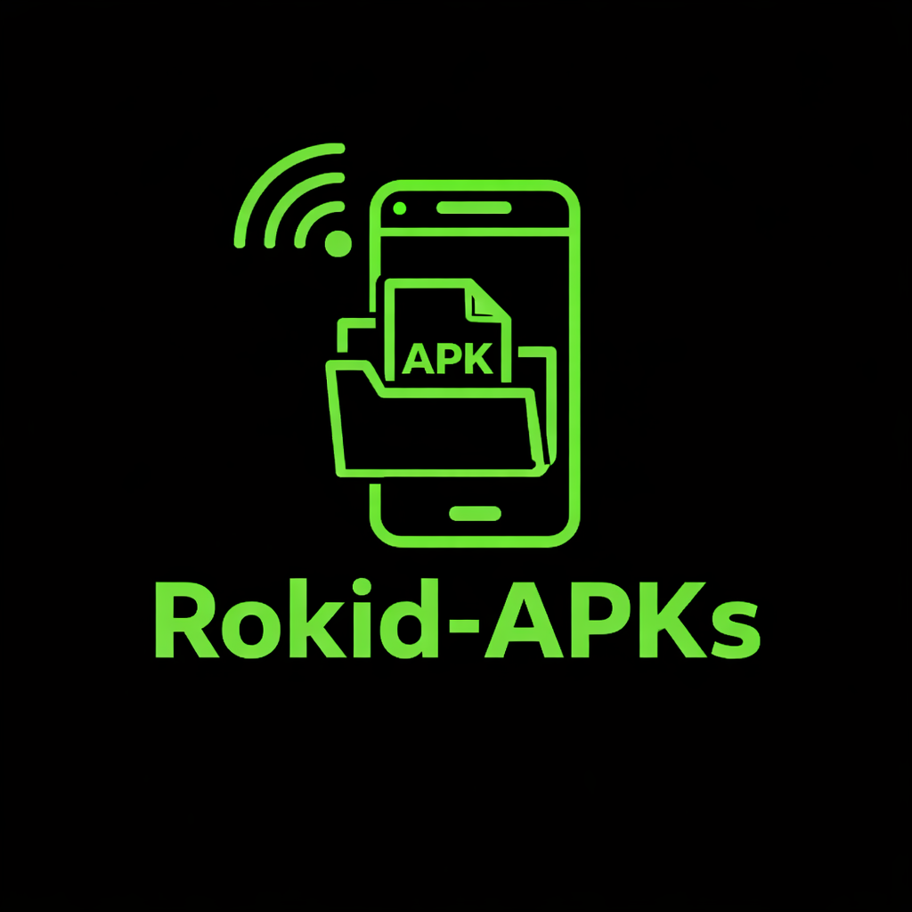
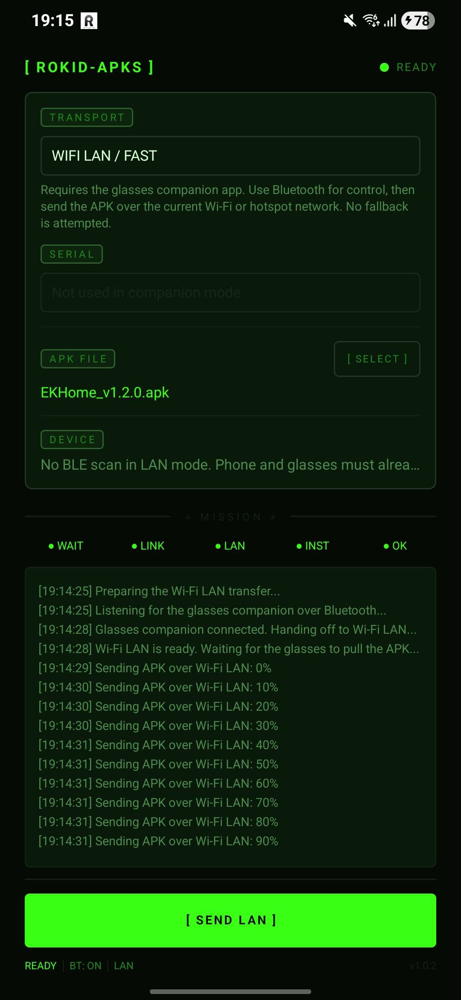
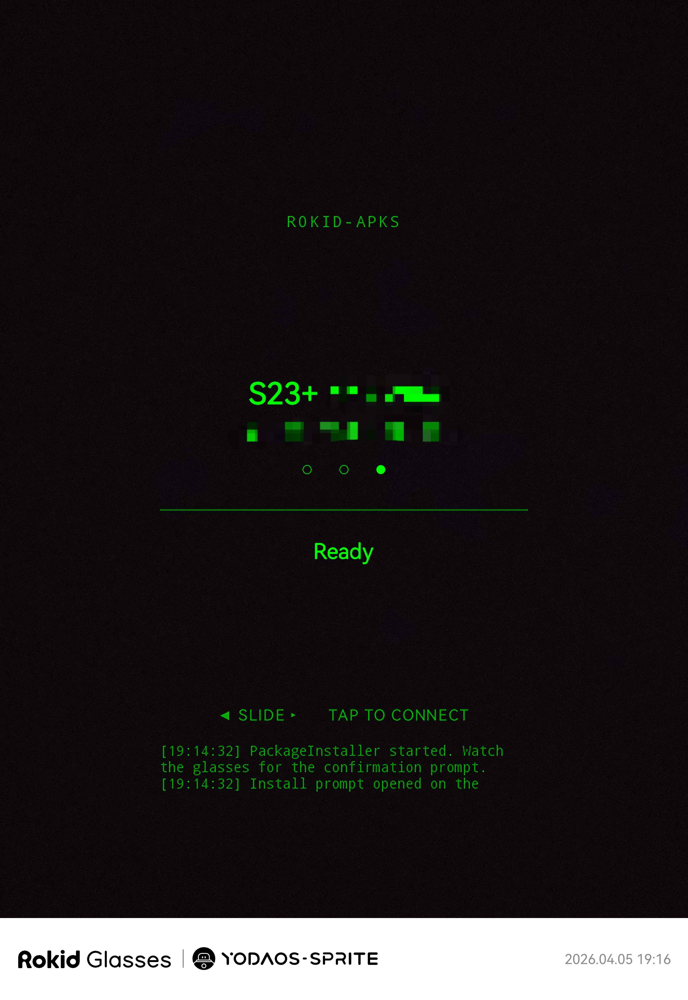

## Rokid-APKs

<p align="center">
  
</p>

<p align="center">
  Install Android APKs on Rokid glasses from your phone with three local transfer modes:
  official CXR, direct Bluetooth SPP, or Wi-Fi LAN with a glasses companion.
</p>

---

## Screenshots

<p align="center">
  
  &nbsp;&nbsp;&nbsp;&nbsp;
  
</p>
<p align="center">
  <em>Phone uploader app · Rokid glasses companion HUD</em>
</p>

---

## Latest update

This repo is no longer only an updated CXR uploader.

Recent work added a full companion flow for Rokid glasses and split the phone app into three explicit user-selected modes:

- `CXR / OFFICIAL` for the classic Rokid BLE + Wi-Fi Direct path
- `SPP / SLOW` for a fully local Bluetooth-only companion flow
- `WIFI LAN / FAST` for Bluetooth control plus APK transfer over the current Wi-Fi or hotspot network

The companion app on the glasses receives the APK, launches `PackageInstaller`, and lets the user confirm install directly on-device.

---

## How it works

`Rokid-APKs` now supports two different families of install flow.

### 1. Official Rokid flow

The phone app scans for Rokid glasses over BLE, opens the Rokid Bluetooth control channel, brings up Wi-Fi Direct, uploads the selected APK, and asks the glasses to install it.

This is the original Rokid-style path and does **not** require any companion app on the glasses.

### 2. Companion flow

The phone app talks to a dedicated glasses companion app over Bluetooth SPP. From there, the payload goes one of two ways:

- `SPP / SLOW`: the whole APK is streamed over Bluetooth SPP
- `WIFI LAN / FAST`: Bluetooth is used only for control, then the APK is pulled over the current Wi-Fi or hotspot network

The companion stores the APK locally on the glasses and starts the Android installer UI on the glasses so the user can confirm the install there.

No desktop helper. No cloud relay. Everything stays local between the phone and the glasses.

---

## Modes

| Mode | Needs glasses companion app | Network requirement | Notes |
| --- | --- | --- | --- |
| `CXR / OFFICIAL` | No | Rokid BLE + Wi-Fi Direct | Uses the official Rokid stack |
| `SPP / SLOW` | Yes | None beyond Bluetooth pairing | Slowest, but works fully offline |
| `WIFI LAN / FAST` | Yes | Phone and glasses on the same Wi-Fi or hotspot | Fastest companion mode |

Important:

- `SPP / SLOW` and `WIFI LAN / FAST` require the phone and glasses to already be paired in Android Bluetooth settings.
- `CXR / OFFICIAL` does not use the companion app on the glasses.
- `WIFI LAN / FAST` does not auto-fallback to another mode. If LAN is not available, switch modes manually in the phone app.

---

## Features

- Modernized Rokid CXR upload flow for newer phones and newer Rokid samples
- Separate glasses companion app for local install workflows
- Three explicit transfer modes with no automatic transport switching
- Direct APK install confirmation on the glasses through `PackageInstaller`
- Phone UI with live phase/status feedback
- Optional serial-number auth path for the official CXR mode

---

## Project structure

```text
app/            Android phone uploader app
glasses-app/    Android glasses companion app
```

---

## Private credentials

Only the `CXR / OFFICIAL` mode depends on Rokid credentials and auth data.

The companion modes do not need Rokid BLE auth blobs because they do not use the official Rokid upload channel.

For the official mode:

1. Copy `local.properties.example` to `local.properties`.
2. Set `rokid.clientSecret` to your own Rokid developer client secret.
3. If you use a Rokid auth blob, set `rokid.authBlobName` to the raw resource name without the `.lc` extension.
4. Place the matching `.lc` file in `app/src/main/res/raw/<rokid.authBlobName>.lc`.

Example:

```properties
sdk.dir=C\:\\Users\\YourName\\AppData\\Local\\Android\\Sdk
rokid.clientSecret=your-rokid-client-secret
rokid.authBlobName=sn_your_auth_blob_name
```

If you prefer, you can leave out `rokid.authBlobName` and enter the glasses serial number directly in the phone app. In that case you still need `rokid.clientSecret`.

Any APK you build locally with your own Rokid credentials will embed those values in the generated phone app. Do not redistribute credentialed builds.

---

## Build

```powershell
$env:JAVA_HOME='C:\Program Files\Java\jdk-22'
$env:Path="$env:JAVA_HOME\bin;$env:Path"
.\gradlew.bat :app:assembleDebug :glasses-app:assembleDebug
```

Debug outputs:

- Phone APK: `app/build/outputs/apk/debug/app-debug.apk`
- Glasses APK: `glasses-app/build/outputs/apk/debug/glasses-app-debug.apk`

---

## First run

### Official CXR mode

1. Install the phone app on your Android phone.
2. Open `Rokid-APKs` on the phone.
3. Select `CXR / OFFICIAL`.
4. Grant the requested Bluetooth, nearby, and Wi-Fi permissions.
5. Optionally enter the glasses serial number if you are using the serial auth path.
6. Put the Rokid glasses into their Bluetooth pairing flow.
7. Tap `Select` and choose the APK you want to send.
8. Tap `Scan` and pick the detected Rokid glasses.
9. Tap `Upload APK` and accept the Bluetooth prompt if Android shows one.
10. Wait for the app to move through BLE, auth, Wi-Fi Direct, upload, and install.

### Companion modes

1. Install the phone app on the Android phone.
2. Install the glasses companion app on the Rokid glasses.
3. Pair the phone and the glasses in Android Bluetooth settings first.
4. Open the phone app and choose either `SPP / SLOW` or `WIFI LAN / FAST`.
5. Tap `Select` and choose the APK you want to install.
6. Open the companion app on the glasses.
7. Select the paired phone if more than one device is listed.
8. Start the transfer from the phone, then connect from the glasses if needed.
9. Confirm the install in the Android installer UI on the glasses.

### Notes for each companion mode

- `SPP / SLOW`: no Wi-Fi is required, but large APKs transfer more slowly.
- `WIFI LAN / FAST`: the phone and the glasses must already share the same Wi-Fi network or phone hotspot.

---

## Why this repo exists

The original `RokidApkUploader` flow was built around older CXR-M SDK behavior and no longer worked reliably on recent phones and newer Rokid samples.

This project started as a rework of that flow around the current Rokid SDK and newer sample logic, then expanded into a companion-based installer for cases where users want a simpler local workflow that does not depend on the full official Rokid transport path.

---

## Credits

Based on [Miniontoby/RokidApkUploader](https://github.com/Miniontoby/RokidApkUploader) - the original APK uploader for Rokid glasses.

This fork updates the connection flow for the newer CXR-M SDK, adds a redesigned phone UI, and introduces a dedicated glasses companion app with SPP and Wi-Fi LAN install paths.

---

## Notes

- The repo ignores `local.properties`, `.lc` auth blobs, build outputs, and keystores so they do not end up in Git by accident.
- The official CXR mode still depends on phone vendor Bluetooth and Wi-Fi Direct behavior, which can vary across devices.
- The companion flow has been tested on real Rokid glasses with both `SPP / SLOW` and `WIFI LAN / FAST`.
